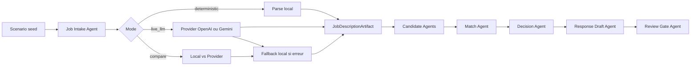

# IA Recruter

IA Recruter est un projet portfolio concu pour prouver des competences en architecture de systemes multi-agents IA sur un cas d'usage RH lisible : analyser des candidatures email, produire des artefacts intermediaires, classer les profils et garder un humain dans la boucle.

Le projet ne cherche pas a simuler un ATS complet. Il cherche a montrer une pensee d'architecte : quand utiliser du deterministe, quand utiliser un provider LLM, comment fallback proprement, comment tracer les runs, et comment rendre les sorties inspectables.

Positionnement honnete :

- IA Recruter est aujourd'hui un `pipeline multi-agent local` et une `demo agentique hybride`
- ce n'est pas encore un `veritable systeme agentique distribue`
- le terme `distribue` supposerait des agents reels separes, une communication explicite, une persistance durable et une supervision inter-service, ce que cette V1 ne cherche pas encore a livrer

## Competences que ce projet doit prouver

1. `Architecture de systeme multi-agent`
   - run engine separe de l'UI
   - agents nommes et responsabilites nettes
   - handoffs visibles
2. `Arbitrage LLM vs deterministe`
   - modes `deterministic`, `live_llm`, `compare`
   - provider demande vs provider effectif
   - fallback explicite
3. `Supervision humaine et gouvernance`
   - review gate
   - aucune action finale automatique
   - limites et garde-fous visibles
4. `Explicabilite et artefacts`
   - artefacts inspectables
   - decision rationale
   - comparaison local vs provider
5. `Qualite d'implementation`
   - types forts
   - couche provider dediee
   - tests utiles
6. `Pensee produit pour demo technique`
   - UX lisible
   - etats vides coherents
   - demo stable sans cle

## Ce que fait le systeme

- rejoue un scenario seed complet en lecture seule
- structure la fiche seed localement ou via provider
- normalise un lot de candidatures seed
- compare chaque profil a la fiche
- produit score, decision, justification et brouillon
- expose les artefacts du pipeline
- documente le fallback et la revue humaine

## Probleme et solution

Probleme :
- un recruteur ou evaluateur produit voit rarement la logique intermediaire d'un systeme IA
- les demos "multi-agent" sont souvent soit trop opaques, soit trop fragiles
- il est difficile de prouver qu'on sait arbitrer entre robustesse, explicabilite et usage reel du LLM

Solution :
- une console de screening RH qui montre un pipeline agentique lisible
- un mode deterministic stable pour la demo
- un chemin provider qui peut aussi influencer les agents candidat
- un mode compare qui rend visible l'ecart entre pipeline local et pipeline provider
- une gouvernance explicite qui bloque toute action externe automatique

## Modes d'execution

- `deterministic`
  - aucune cle requise
  - demo stable
  - fallback de reference
- `live_llm`
  - utilise une cle utilisateur BYOK
  - utilise le provider sur la lecture de fiche puis sur les agents candidat quand disponible
  - fallback local si cle absente ou erreur provider
- `compare`
  - execute un run local et un run provider sur le meme scenario seed
  - expose un artefact de comparaison sur la fiche, les scores, les decisions, les rangs et les brouillons

## Ce que le projet ne cherche pas a prouver

- un ATS complet
- une automatisation finale du recrutement
- une precision RH de production
- une securite enterprise exhaustive
- un parsing CV avance a grande echelle

## Surfaces produit

- `Screening`
  - scenario seed en lecture seule
  - mode d'execution
  - resume des differences de run
  - progression
  - ranking
  - detail candidat
  - governance
- `Agent Relay`
  - etapes du pipeline
  - provider effectif
  - fallback
  - artifact inspector
- `Playground`
  - BYOK OpenAI / Gemini
  - preparation du mode live

## Architecture actuelle

- `src/lib/runEngine.ts`
  - moteur d'execution
  - construit les blueprints de run
- `src/infrastructure/providers/providerAdapters.ts`
  - resolution provider
  - extraction live de fiche de poste
  - analyse provider des candidats
  - fallback local
- `src/hooks/useRecruiterDemo.ts`
  - orchestration UI locale
  - historique navigateur
  - replay du pipeline
- `src/App.tsx`
  - presentation et inspection des sorties

## Graphe du systeme



## Artefacts visibles

- `Structured job description`
- `Candidate profile`
- `Match matrix`
- `Decision`
- `Response draft`
- `Execution comparison`
- `Run summary`

Le `compare mode` affiche desormais une lecture dediee `local vs provider` sur la fiche et sur les sorties candidat, au lieu de se limiter a un simple delta de job intake.

## Parcours de demo recommande

1. Ouvrir `Screening` et montrer le scenario seed en lecture seule.
2. Lancer un run `deterministic` pour montrer le pipeline stable et le classement.
3. Montrer le detail d'un candidat et les artefacts.
4. Ouvrir `Agent Relay` pour inspecter le handoff des agents.
5. Passer en mode `compare`, relancer et montrer les deltas `local vs provider`.
6. Montrer le bloc `Governance` pour rappeler la supervision humaine.

## Deploiement Vercel

Le projet est une app Vite statique :

- `buildCommand`: `npm run build`
- `outputDirectory`: `dist`
- aucune variable d'environnement obligatoire pour la demo `deterministic`

Deploiement via CLI :

```bash
vercel login
vercel
vercel --prod
```

Le mode `live_llm` reste en `BYOK` cote navigateur : le testeur colle sa propre cle OpenAI ou Gemini dans l'interface.

## Lancer le projet

```bash
npm install
npm run dev
```

Build :

```bash
npm run build
```

Tests :

```bash
npm test
```

## Variables d'environnement

Aucune variable d'environnement n'est requise pour lancer la demo locale en `deterministic`.

Le projet est pense en `BYOK` :
- la cle OpenAI ou Gemini se saisit dans l'onglet `Playground`
- la cle n'est pas committee
- la demo reste fonctionnelle sans cle

Le fichier [.env.example](./.env.example) sert uniquement de repere documentaire pour une future evolution vers un proxy ou une execution developpeur plus centralisee.

## Securite et garde-fous

- aucune cle API n'est necessaire pour la demo par defaut
- aucune cle n'est stockee dans le repo
- aucun envoi d'email automatique n'existe dans cette V1
- le fallback local est visible et explicite
- la revue humaine reste obligatoire avant toute action externe
- le projet ne pretend pas rendre une decision RH finale autonome

## Publication

- build statique Vite, publiable sur Vercel ou Netlify
- mode `deterministic` par defaut pour garantir une demo publique stable
- mode `live_llm` et `compare` disponibles en option via cle utilisateur
- fichiers de deploy fournis :
  - `vercel.json`
  - `netlify.toml`

Guides associes :
- [docs/PUBLICATION_CHECKLIST.md](./docs/PUBLICATION_CHECKLIST.md)
- [docs/DEPLOYMENT_GUIDE.md](./docs/DEPLOYMENT_GUIDE.md)

## Limites actuelles

- seul le `Job Intake Agent` dispose d'un premier chemin live reel
- le mode `compare` est pour l'instant centre sur la fiche de poste
- les candidatures restent seed et non issues d'une inbox reelle
- l'envoi email reste volontairement hors scope

## Documents de cadrage

- `PROJECT_KICKOFF.md`
- `DELIVERY_PLAN.md`
- `DECISIONS.md`
- `AGENT_START.md`
- `docs/MENTOR_MODE_PROTOCOL.md`
- `docs/UX_UI_GUIDELINES.md`
- `docs/CLEAN_ARCHITECTURE_RULES.md`
- `docs/WORKFLOW_SCHEMA.md`
- `docs/VIDEO_DEMO_SCRIPT.md`
- `docs/PORTFOLIO_PROOF_PACK.md`
- `docs/CONTENT_ANGLES.md`
- `docs/PUBLICATION_CHECKLIST.md`
- `docs/DEPLOYMENT_GUIDE.md`

## Prochaine priorite

Finaliser les assets de preuve et la publication publique : captures finales, video courte, deployment et capitalisation dans le template de futurs projets portfolio multi-agents.
