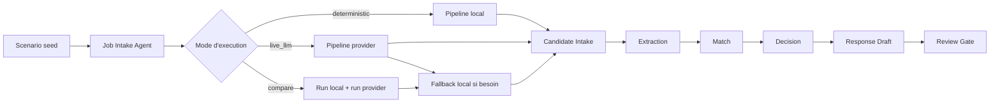

# Agent Assistant Recrutement

Demo portfolio d'un systeme de recrutement assiste par IA, construit pour montrer un pipeline multi-agent lisible, un arbitrage local vs provider, des artefacts inspectables et une revue humaine avant toute action finale.

## Probleme

La plupart des demos IA montrent un resultat final, mais tres peu montrent :

- comment le systeme lit les entrees
- comment les etapes se passent le relais
- ou le provider intervient vraiment
- comment le fallback est gere
- ou l'humain reprend la main

Dans un workflow sensible comme le recrutement, cette opacite pose un probleme simple :
on peut difficilement faire confiance a une decision que l'on ne peut ni suivre, ni comparer, ni expliquer.

## Solution

`Agent Assistant Recrutement` est une console de screening seedee qui rejoue toujours le meme scenario de recrutement pour rendre la demo stable, lisible et defendable. Le produit affiche un pipeline d'agents nommes, supporte trois modes d'execution (`deterministic`, `live_llm`, `compare`), expose les artefacts intermediaires, puis garde une revue humaine obligatoire avant toute suite. Le projet est volontairement un `pipeline multi-agent local` et une `demo agentique hybride`, pas un systeme distribue complet.

## Pourquoi ce projet existe

Je ne voulais pas faire "encore une demo RH".

Je voulais montrer quelque chose de plus utile :

- un workflow agentique visible
- un moteur de run separe de l'interface
- un fallback explicite
- une comparaison local vs provider
- une gouvernance lisible

L'objectif est de prouver une competence d'architecture IA sur un cas metier simple a comprendre.

## Ce que montre la demo

Depuis l'interface, on peut :

- ouvrir un scenario seed fixe
- consulter la fiche de poste en lecture seule
- consulter les candidats seedes en lecture seule
- choisir un mode d'execution
- lancer un run
- inspecter le classement, les details, le relay et les artefacts

Le systeme :

- lit la fiche de poste
- relit les candidatures
- extrait les signaux utiles
- compare les profils au besoin
- propose une decision
- prepare un brouillon de reponse
- impose une revue humaine finale

## Workflow agentique

Le produit est presente en etapes visibles :

### Job Intake Agent

Lit la fiche de poste seedee et produit une version structuree exploitable par le reste du pipeline.

### Candidate Intake Agent

Recupere les informations cle de chaque candidature du lot seed.

### Extraction Agent

Extrait les signaux utiles du profil candidat : competences, experience, points forts et zones d'incertitude.

### Match Agent

Compare le profil aux criteres du poste et produit un matching plus explicite.

### Decision Agent

Propose un score, une decision et une justification.

### Response Draft Agent

Prepare un brouillon de reponse adapte a la decision.

### Review Gate Agent

Rappelle que la validation finale reste humaine.

## Positionnement produit

Ce projet n'est pas :

- un ATS complet
- une inbox de recrutement connectee
- un systeme qui recrute seul
- un systeme agentique distribue deja industrialise

C'est une demo portfolio pensee pour :

- les recruteurs techniques
- les CTO et leads IA
- les fondateurs qui veulent evaluer une logique produit
- les portfolios orientes workflows IA

Use case central :

prendre un lot seed de candidatures, le faire passer dans un pipeline agentique lisible, comparer un chemin local et un chemin provider, puis montrer comment la decision reste explicable et supervisee.

## Vue d'ensemble de l'interface

### Run

- choisir le mode `deterministic`, `live_llm` ou `compare`
- choisir le provider si besoin
- saisir une cle API BYOK si l'on veut tester un provider
- lancer le run
- visualiser le passage de relais entre agents

### Candidates

- consulter le lot seed de candidats
- ouvrir le detail d'un candidat
- comparer score, decision, matching et brouillon

### Artifacts

- inspecter la fiche structuree
- inspecter le matching candidat
- inspecter la decision
- inspecter le draft
- inspecter l'artefact de comparaison en mode `compare`

### Governance

- voir les messages de fallback
- voir les limites du systeme
- voir le rappel de supervision humaine

## Modes d'execution

### Deterministic

Mode stable, local et testable sans cle API.

### Live LLM

Mode provider reel, BYOK, pour observer comment le pipeline se comporte avec OpenAI ou Gemini.

### Compare

Mode qui confronte deux executions sur le meme scenario :

- un run local
- un run provider

Puis affiche les ecarts sur la lecture de la fiche, les scores, les decisions et les brouillons.

## Demo principale

1. L'utilisateur ouvre le scenario seed de reference.
2. Il choisit `deterministic`, `live_llm` ou `compare`.
3. Le systeme execute le pipeline et affiche les etapes, les artefacts et les resultats.
4. L'utilisateur peut comparer les profils, ouvrir le relay, comprendre les decisions et verifier ou l'humain intervient.

Ce que le resultat prouve :

- une architecture multi-agent lisible
- un arbitrage local vs provider
- un fallback defendable
- une explicabilite par artefacts
- une supervision humaine explicite

## Vue d'ensemble de l'architecture



L'interface declenche un run via `runEngine`, qui orchestre le scenario seed. La logique provider est isolee dans `providerAdapters`. En mode `compare`, le systeme rejoue le meme lot dans deux chemins distincts, puis affiche les ecarts visibles pour aider a juger la difference entre local et provider.

## Fonctionnalites

- scenario seed fixe pour des demos stables et defendables
- pipeline multi-agent nomme avec handoffs visibles
- modes `deterministic`, `live_llm` et `compare`
- support BYOK OpenAI et Gemini
- artefacts inspectables a chaque etape utile
- fallback explicite quand le provider n'est pas disponible ou echoue
- comparaison local vs provider sur le meme scenario
- revue humaine obligatoire avant toute action finale

## Stack technique

- Frontend : React, TypeScript, Vite
- Backend : aucun dans cette V1
- IA / Providers : OpenAI, Gemini, moteur deterministe local
- Donnees / Stockage : scenario seed local, etat navigateur
- Tests : Vitest, Testing Library

## Structure du projet

```text
src/
  data/
  hooks/
  infrastructure/
  lib/
  types/
tests/
docs/
scripts/
```

## Lancer le projet en local

```bash
npm install
npm run dev
```

## Build

```bash
npm run build
```

## Tests

```bash
npm test
```

## Variables d'environnement

Aucune variable d'environnement n'est requise pour la demo publique en `deterministic`.

Le projet suit un modele BYOK :

- les cles provider sont saisies dans l'interface
- elles ne sont pas commit dans le depot
- la demo reste utile sans cle

Voir [.env.example](./.env.example) pour le format documente.

## Notes de securite

- aucune cle API n'est requise pour la demo par defaut
- les secrets ne sont pas stockes dans le depot
- `live_llm` et `compare` sont optionnels et BYOK
- aucune action externe reelle n'est declenchee
- l'envoi d'email est mocke dans cette V1
- une revue humaine reste obligatoire
- ce projet n'est pas concu pour un usage RH autonome en production

## Ce que le projet demontre

- orchestration multi-agent sur un cas metier clair
- separation entre UI, moteur de run et couche provider
- arbitrage deterministe vs LLM
- compare mode utile pour juger un systeme
- fallback visible et defendable
- explicabilite par artefacts
- pensee produit et UX de demonstration

## Perimetre actuel

- scenario de recrutement seed en lecture seule
- pipeline multi-agent local avec artefacts visibles
- execution locale stable
- execution provider optionnelle
- comparaison local vs provider sur le meme lot

## Limites actuelles

- pas de vraie inbox email ou d'ATS connecte
- pas d'upload libre de candidats dans cette V1
- pas de backend durable ni d'authentification
- pas d'orchestration distribuee reelle
- la demo publique repose sur un seul scenario seed fixe

## Angle portfolio

Le projet est mieux presente comme :

un systeme de recrutement assiste par IA qui montre un pipeline multi-agent local, compare une execution deterministe et une execution provider, expose ses artefacts intermediaires et garde l'humain dans la boucle

## Ameliorations futures

- ajouter une couche backend pour stocker les runs durablement
- decouper certaines etapes en vrais services ou workers
- enrichir l'observabilite et la telemetrie
- ajouter d'autres scenarios seed ou un mode sandbox plus large

## Assets de demo

- [Schema de workflow](./docs/public/WORKFLOW_SCHEMA.md)
