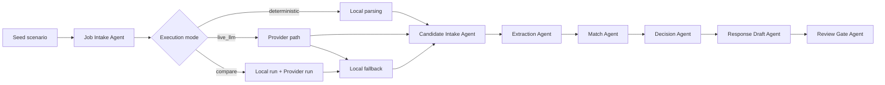

# IA Recruter

Démo portfolio d'une console de recrutement assistée par IA qui sert à prouver des choix d'architecture multi-agent, des fallbacks déterministes, une intégration provider, et une revue humaine sur un scénario seed fixe.

## Problème

- Les évaluateurs techniques voient rarement la logique intermédiaire d'un workflow IA, seulement le résultat final.
- Beaucoup de démos "multi-agent" sont soit opaques, soit fragiles, soit trop ambitieuses sur ce qui est réellement live.
- Il est difficile de prouver un vrai jugement d'architecture sur l'usage des LLM, le fallback, la traçabilité et la supervision humaine dans une démo compacte.

## Solution

IA Recruter est une console de screening seedée qui rejoue le même scénario de recrutement à travers des agents nommés, expose chaque artefact du pipeline, supporte les modes `deterministic`, `live_llm` et `compare`, et conserve une revue humaine avant toute action externe. Le projet est volontairement un `pipeline multi-agent local` et une `démo agentique hybride`, pas un système agentique distribué.

## Démo principale

1. L'utilisateur ouvre un scénario seed fixe avec une fiche de poste en lecture seule et des candidats seedés.
2. Le système exécute le pipeline en `deterministic`, `live_llm` ou `compare`.
3. L'utilisateur voit le classement, le détail candidat, les étapes du relay et les artefacts.
4. Le résultat prouve des choix d'architecture : stabilité locale, fallback provider, handoffs visibles et gouvernance explicite.

## Vue d'ensemble de l'architecture



L'interface déclenche un run via `runEngine`, qui orchestre le scénario seed. `providerAdapters` décide si l'exécution reste locale ou appelle OpenAI/Gemini. En mode `compare`, le système exécute à la fois un run local et un run provider sur le même seed, puis expose l'écart sur le parsing de fiche et les sorties candidat.

## Fonctionnalités

- Scénario seed fixe pour des démos publiques stables et défendables
- Pipeline multi-agent nommé avec handoffs visibles et étapes rejouables
- Modes `deterministic`, `live_llm` et `compare`
- Support BYOK OpenAI / Gemini dans le navigateur
- Inspecteur d'artefacts pour le parsing de fiche, le profil candidat, le matching, la décision, le brouillon, la comparaison et le résumé de run
- Revue humaine obligatoire et messages de fallback explicites

## Stack technique

- Frontend: React, TypeScript, Vite
- Backend: aucun dans cette V1
- IA / Providers: OpenAI, Gemini, moteur déterministe local
- Données / Stockage: données locales seedées, état navigateur
- Tests: Vitest, Testing Library

## Structure du projet

```text
src/
  data/
  hooks/
  infrastructure/
  lib/
tests/
docs/
scripts/
```

## Lancement local

```bash
npm install
npm run dev
```

## Build

```bash
npm run build
```

## Tests

```bash
npm test
```

## Variables d'environnement

Aucune variable d'environnement n'est requise pour la démo publique par défaut en `deterministic`.

Le projet suit un modèle BYOK :

- les clés provider sont saisies par l'utilisateur dans l'interface
- les clés ne sont pas commit dans le dépôt
- la démo reste fonctionnelle sans clé

Voir [.env.example](./.env.example) pour le format de placeholder documenté.

## Notes de sécurité

- Aucune clé API n'est requise pour la démo seedée par défaut
- Les secrets ne sont pas stockés dans le dépôt
- `live_llm` et `compare` sont des flux BYOK optionnels côté navigateur
- L'envoi d'email est mocké par design dans cette V1
- Une revue humaine est obligatoire avant toute action externe
- Ce projet n'est pas prêt pour des opérations de recrutement réelles en production

## Périmètre actuel

- Scénario de screening seedé en lecture seule
- Pipeline multi-agent local avec agents nommés et artefacts visibles
- Runs assistés par provider avec fallback explicite et mode compare

## Limites actuelles

- Pas de vraie inbox, d'ATS ou de flux d'upload candidat
- Pas de backend durable, d'authentification ou d'orchestration distribuée
- La démo publique est conçue autour d'un seul scénario seed fixe

## Améliorations futures

- Ajouter une couche d'exécution backend avec stockage durable des runs
- Découper le pipeline en vrais services ou workers pour une version réellement distribuée
- Ajouter une télémétrie d'évaluation plus riche et de l'observabilité côté provider

## Assets de démo

- [Workflow schema](./docs/public/WORKFLOW_SCHEMA.md)
