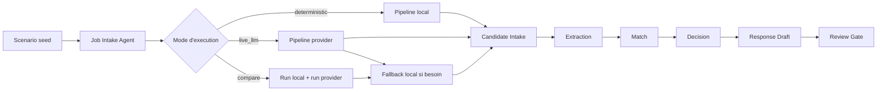

# Agent Assistant Recrutement

Démo portfolio d'un système de recrutement assisté par IA, construit pour montrer un pipeline multi-agent lisible, un arbitrage local vs provider, des artefacts inspectables et une revue humaine avant toute action finale.

## Problème

La plupart des démos IA montrent un résultat final, mais très peu montrent :

- comment le système lit les entrées
- comment les étapes se passent le relais
- où le provider intervient vraiment
- comment le fallback est géré
- où l'humain reprend la main

Dans un workflow sensible comme le recrutement, cette opacité pose un problème simple :
on peut difficilement faire confiance à une décision que l'on ne peut ni suivre, ni comparer, ni expliquer.

## Solution

`Agent Assistant Recrutement` est une console de screening seedée qui rejoue toujours le même scénario de recrutement pour rendre la démo stable, lisible et défendable. Le produit affiche un pipeline d'agents nommés, supporte trois modes d'exécution (`deterministic`, `live_llm`, `compare`), expose les artefacts intermédiaires, puis garde une revue humaine obligatoire avant toute suite. Le projet est volontairement un `pipeline multi-agent local` et une `démo agentique hybride`, pas un système distribué complet.

## Pourquoi ce projet existe

Je ne voulais pas faire "encore une démo RH".

Je voulais montrer quelque chose de plus utile :

- un workflow agentique visible
- un moteur de run séparé de l'interface
- un fallback explicite
- une comparaison local vs provider
- une gouvernance lisible

L'objectif est de prouver une compétence d'architecture IA sur un cas métier simple à comprendre.

## Ce que montre la démo

Depuis l'interface, on peut :

- ouvrir un scénario seed fixe
- consulter la fiche de poste en lecture seule
- consulter les candidats seedés en lecture seule
- choisir un mode d'exécution
- lancer un run
- inspecter le classement, les détails, le relay et les artefacts

Le système :

- lit la fiche de poste
- relit les candidatures
- extrait les signaux utiles
- compare les profils au besoin
- propose une décision
- prépare un brouillon de réponse
- impose une revue humaine finale

## Workflow agentique

Le produit est présenté en étapes visibles :

### Job Intake Agent

Lit la fiche de poste seedée et produit une version structurée exploitable par le reste du pipeline.

### Candidate Intake Agent

Récupère les informations clés de chaque candidature du lot seed.

### Extraction Agent

Extrait les signaux utiles du profil candidat : compétences, expérience, points forts et zones d'incertitude.

### Match Agent

Compare le profil aux critères du poste et produit un matching plus explicite.

### Decision Agent

Propose un score, une décision et une justification.

### Response Draft Agent

Prépare un brouillon de réponse adapté à la décision.

### Review Gate Agent

Rappelle que la validation finale reste humaine.

## Positionnement produit

Ce projet n'est pas :

- un ATS complet
- une inbox de recrutement connectée
- un système qui recrute seul
- un système agentique distribué déjà industrialisé

C'est une démo portfolio pensée pour :

- les recruteurs techniques
- les CTO et leads IA
- les fondateurs qui veulent évaluer une logique produit
- les portfolios orientés workflows IA

Use case central :

prendre un lot seed de candidatures, le faire passer dans un pipeline agentique lisible, comparer un chemin local et un chemin provider, puis montrer comment la décision reste explicable et supervisée.

## Vue d'ensemble de l'interface

### Run

- choisir le mode `deterministic`, `live_llm` ou `compare`
- choisir le provider si besoin
- saisir une clé API BYOK si l'on veut tester un provider
- lancer le run
- visualiser le passage de relais entre agents

### Candidates

- consulter le lot seed de candidats
- ouvrir le détail d'un candidat
- comparer score, décision, matching et brouillon

### Artifacts

- inspecter la fiche structurée
- inspecter le matching candidat
- inspecter la décision
- inspecter le draft
- inspecter l'artefact de comparaison en mode `compare`

### Governance

- voir les messages de fallback
- voir les limites du système
- voir le rappel de supervision humaine

## Modes d'exécution

### Deterministic

Mode stable, local et testable sans clé API.

### Live LLM

Mode provider réel, BYOK, pour observer comment le pipeline se comporte avec OpenAI ou Gemini.

### Compare

Mode qui confronte deux exécutions sur le même scénario :

- un run local
- un run provider

Puis affiche les écarts sur la lecture de la fiche, les scores, les décisions et les brouillons.

## Démo principale

1. L'utilisateur ouvre le scénario seed de référence.
2. Il choisit `deterministic`, `live_llm` ou `compare`.
3. Le système exécute le pipeline et affiche les étapes, les artefacts et les résultats.
4. L'utilisateur peut comparer les profils, ouvrir le relay, comprendre les décisions et vérifier où l'humain intervient.

Ce que le résultat prouve :

- une architecture multi-agent lisible
- un arbitrage local vs provider
- un fallback défendable
- une explicabilité par artefacts
- une supervision humaine explicite

## Vue d'ensemble de l'architecture



L'interface déclenche un run via `runEngine`, qui orchestre le scénario seed. La logique provider est isolée dans `providerAdapters`. En mode `compare`, le système rejoue le même lot dans deux chemins distincts, puis affiche les écarts visibles pour aider à juger la différence entre local et provider.

## Fonctionnalités

- scénario seed fixe pour des démos stables et défendables
- pipeline multi-agent nommé avec handoffs visibles
- modes `deterministic`, `live_llm` et `compare`
- support BYOK OpenAI et Gemini
- artefacts inspectables à chaque étape utile
- fallback explicite quand le provider n'est pas disponible ou échoue
- comparaison local vs provider sur le même scénario
- revue humaine obligatoire avant toute action finale

## Stack technique

- Frontend : React, TypeScript, Vite
- Backend : aucun dans cette V1
- IA / Providers : OpenAI, Gemini, moteur déterministe local
- Données / Stockage : scénario seed local, état navigateur
- Tests : Vitest, Testing Library

## Structure du projet

```text
src/
  data/
  hooks/
  infrastructure/
  lib/
  types/
tests/
docs/
scripts/
```

## Lancer le projet en local

```bash
npm install
npm run dev
```

## Build

```bash
npm run build
```

## Tests

```bash
npm test
```

## Variables d'environnement

Aucune variable d'environnement n'est requise pour la démo publique en `deterministic`.

Le projet suit un modèle BYOK :

- les clés provider sont saisies dans l'interface
- elles ne sont pas commit dans le dépôt
- la démo reste utile sans clé

Voir [.env.example](./.env.example) pour le format documenté.

## Notes de sécurité

- aucune clé API n'est requise pour la démo par défaut
- les secrets ne sont pas stockés dans le dépôt
- `live_llm` et `compare` sont optionnels et BYOK
- aucune action externe réelle n'est déclenchée
- l'envoi d'email est mocké dans cette V1
- une revue humaine reste obligatoire
- ce projet n'est pas conçu pour un usage RH autonome en production

## Ce que le projet démontre

- orchestration multi-agent sur un cas métier clair
- séparation entre UI, moteur de run et couche provider
- arbitrage déterministe vs LLM
- compare mode utile pour juger un système
- fallback visible et défendable
- explicabilité par artefacts
- pensée produit et UX de démonstration

## Périmètre actuel

- scénario de recrutement seed en lecture seule
- pipeline multi-agent local avec artefacts visibles
- exécution locale stable
- exécution provider optionnelle
- comparaison local vs provider sur le même lot

## Limites actuelles

- pas de vraie inbox email ou d'ATS connecté
- pas d'upload libre de candidats dans cette V1
- pas de backend durable ni d'authentification
- pas d'orchestration distribuée réelle
- la démo publique repose sur un seul scénario seed fixe

## Angle portfolio

Le projet est mieux présenté comme :

un système de recrutement assisté par IA qui montre un pipeline multi-agent local, compare une exécution déterministe et une exécution provider, expose ses artefacts intermédiaires et garde l'humain dans la boucle

## Améliorations futures

- ajouter une couche backend pour stocker les runs durablement
- découper certaines étapes en vrais services ou workers
- enrichir l'observabilité et la télémétrie
- ajouter d'autres scénarios seed ou un mode sandbox plus large

## Assets de démo

- [Schéma de workflow](./docs/public/WORKFLOW_SCHEMA.md)
