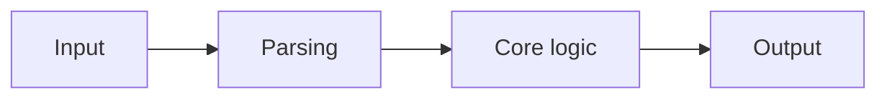

# GitHub README Template

```md
# Project Name

One-line value proposition.

## Problem

- What problem does this project solve?
- Who has this problem?
- Why is this problem worth solving?

## Solution

Explain the product in one short paragraph.

## Main demo

Describe the exact demo flow:

1. what the user inputs
2. what the system does
3. what the user sees
4. what the result proves

## Architecture overview



Explain the communication between the main agents, modules or services.

## Features

- Feature 1
- Feature 2
- Feature 3

## Tech stack

- Frontend:
- Backend:
- AI / Providers:
- Data / Storage:
- Testing:

## Project structure

```text
src/
  app/
  components/
  features/
  domain/
  services/
  lib/
tests/
docs/
scripts/
```

## Local setup

```bash
npm install
npm run dev
```

## Build

```bash
npm run build
```

## Tests

```bash
npm test
```

## Environment variables

Document the required variables and point to `.env.example`.

## Security notes

- How secrets are handled
- What is mocked vs real
- What is not production-safe yet

## Current scope

- included
- included
- included

## Current limits

- not included
- not included
- not included

## Future improvements

- improvement 1
- improvement 2

## Demo assets

- screenshots
- workflow schema
- short video demo
```
