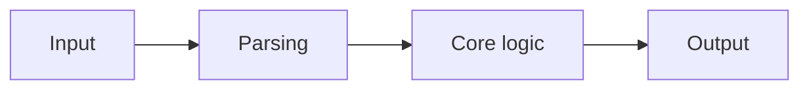

# Template README FR

```md
# Nom du projet

Une phrase de proposition de valeur.

## Probleme

- Quel probleme ce projet resout-il ?
- Pour qui ?
- Pourquoi ce probleme merite-t-il une solution ?

## Solution

Explique en un court paragraphe ce que fait le produit.

## Demo principale

Decris le scenario principal :

1. ce que l'utilisateur entre
2. ce que le systeme fait
3. ce que l'utilisateur voit
4. ce que cela prouve

## Architecture



Explique comment les agents, modules ou services communiquent.

## Fonctionnalites

- Fonctionnalite 1
- Fonctionnalite 2
- Fonctionnalite 3

## Stack technique

- Frontend :
- Backend :
- IA / Providers :
- Donnees / Stockage :
- Tests :

## Structure du projet

```text
src/
  app/
  components/
  features/
  domain/
  services/
  lib/
tests/
docs/
scripts/
```

## Installation locale

```bash
npm install
npm run dev
```

## Build

```bash
npm run build
```

## Tests

```bash
npm test
```

## Variables d'environnement

Documente les variables attendues et renvoie vers `.env.example`.

## Securite

- Comment les secrets sont geres
- Ce qui est mocke vs reel
- Ce qui n'est pas encore production-safe

## Scope actuel

- inclus
- inclus
- inclus

## Limites actuelles

- non inclus
- non inclus
- non inclus

## Evolutions possibles

- amelioration 1
- amelioration 2

## Assets de demo

- captures
- schema workflow
- video courte
```
