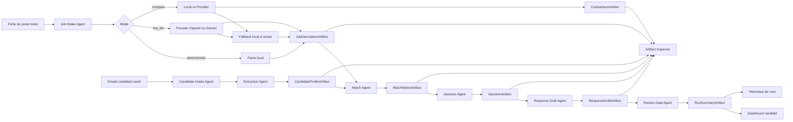

# Workflow Schema

## Lecture rapide

- La fiche de poste brute est l'entree unique cote recruteur.
- Le `Job Intake Agent` est le premier point ou la logique locale et provider divergent.
- Le systeme peut tourner en `deterministic`, `live_llm` ou `compare`.
- Le fallback est une partie visible du systeme, pas un detail cache.
- Chaque agent important produit un artefact consultable.
- Le `Review Gate Agent` rappelle que la decision finale reste supervisee.

## Ce que ce schema prouve

- decomposition claire des responsabilites
- arbitrage entre chemin local et chemin live
- instrumentation par artefacts
- place explicite de la revue humaine
